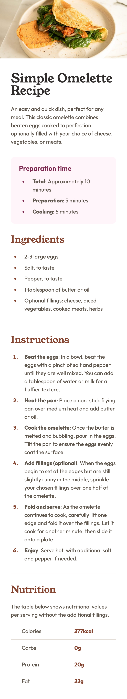
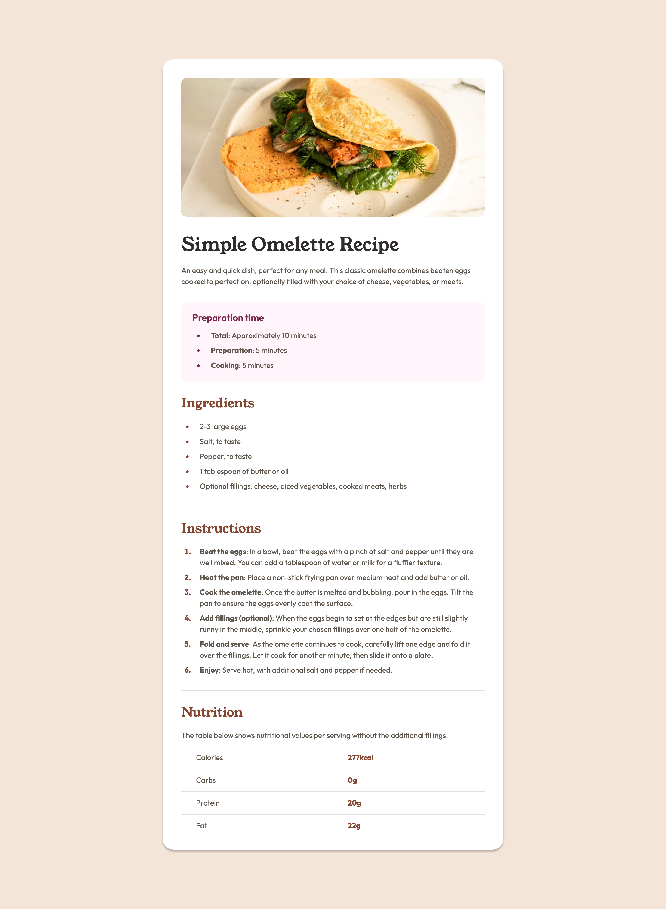

# Frontend Mentor - Recipe page solution

This is my solution to the [Recipe page challenge on Frontend Mentor](https://www.frontendmentor.io/challenges/recipe-page-KiTsR8QQKm), a platform that helps improve your coding skills by building realistic projects.

## Table of contents

- [Overview](#overview)
  - [Screenshots](#screenshots)
  - [Links](#links)
- [My process](#my-process)
  - [Built with](#built-with)
  - [What I learnt](#what-i-learnt)
  - [Useful resources](#useful-resources)

## Overview

### Screenshots

Mobile:



Desktop:



### Links

- [Solution URL](https://www.frontendmentor.io/solutions/responsive-recipe-page-H7DVKnWEpo)
- [Live site URL](https://recipe-page-pied-mu.vercel.app/)

## My process

### Built with

- Semantic HTML5 markup
- CSS custom properties
- Flexbox
- Mobile-first workflow

### What I learnt

I found this challenge was perfect for practicing HTML and getting the semantics and page accessibility right, as well as thinking through the structure and class naming to avoid repetition for sections that share styles.

Specifically, I learnt how the `section` element can be treated as an explicit landmark by exposing its implicit `role="region"`. This can be done by labelling the `section` with `aria-labelledby` and associating it with its respective `h2` heading, improving accessibility by allowing screen reader users to jump directly to different sections.

```html
<section aria-labelledby="instructions">
  <h2 id="instructions">Instructions</h2>
  <ol>
    ...
  </ol>
</section>
```

I also learnt about table syntax and the proper use of the `table`, `tr`, `th` and `td` elements.

`table` holds all the table content, `tbody` (not strictly required in the markup as browsers insert it automatically, but including it improves readability) wraps the main part of the table content, `tr` creates a table row, `th` creates a single table header cell and `td` creates a single table cell.

I also learnt how the `scope` attribute on `th` elements improves accessibility, as it associates each table header with all the data in that column or row.

```html
<table class="recipe-subsection__table">
  <tbody>
    <tr>
      <th scope="row">Calories</th>
      <td>277kcal</td>
    </tr>
  </tbody>
</table>
```

Lastly, I learnt about the `::marker` pseudo-element, which I used to style the bullets and numbers in the unordered and ordered lists respectively, as well as more complex pseudo-classes such as `:not()`, `:first-of-type` and `:last-of-type`

```css
/* add a border-bottom under every row except the last one */
tr:not(:last-of-type) {
  border-bottom: 1px solid var(--clr-border);
}

/* remove padding-top and padding-bottom from the cells in the first and last rows respectively */
tr:first-of-type th,
tr:first-of-type td {
  padding-block-start: 0;
}

tr:last-of-type th,
tr:last-of-type td {
  padding-block-end: 0;
}
```

### Useful resources

- [Accessibility of the section element](https://www.scottohara.me/blog/2021/07/16/section.html): This article by Scott O’Hara taught me how to label `section` elements correctly to improve accessibility.
- [HTML table basics](https://developer.mozilla.org/en-US/docs/Learn_web_development/Core/Structuring_content/HTML_table_basics) and [HTML table accessibility](https://developer.mozilla.org/en-US/docs/Learn_web_development/Core/Structuring_content/Table_accessibility): These two guides from MDN helped me understand both table syntax and how to make tables more accessible.
